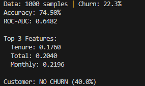

# Customer Churn Prediction using Machine Learning

## Overview
Customer churn prediction is an important problem for subscription-based businesses such as telecom, SaaS, and online services. This project builds a machine learning model that predicts whether a customer will churn or stay based on several attributes such as age, tenure, contract type, and service usage.

The model is trained using a **Random Forest Classifier** and evaluated using **Accuracy Score** and **ROC-AUC Score**.

This project demonstrates a complete machine learning workflow including data generation, preprocessing, model training, evaluation, feature importance analysis, and prediction on new customer data.

---

## Features
- Synthetic dataset generation for customer records
- Data preprocessing using **StandardScaler**
- Train/Test split for model validation
- Random Forest model training
- Model evaluation using Accuracy and ROC-AUC
- Feature importance analysis
- Prediction for a new customer profile

---

## Technologies Used
- Python
- Pandas
- NumPy
- Scikit-learn

---

## Dataset Description
A synthetic dataset of **1000 customer records** is generated with the following features:

| Feature | Description |
|-------|-------------|
| Age | Age of the customer |
| Tenure | Number of months the customer has been with the company |
| Monthly | Monthly subscription charges |
| Total | Total amount spent |
| Contract | Contract type (0 = Month-to-Month, 1 = One Year, 2 = Two Year) |
| Internet | Internet service type |
| Support | Technical support availability |
| Senior | Senior citizen status |

The **Churn** column is generated using probabilistic conditions based on contract type, tenure, monthly charges, and support availability.

---

## Machine Learning Workflow

### 1. Data Generation
Synthetic customer data is generated using **NumPy and Pandas**.

### 2. Data Preprocessing
The dataset is split into **training and testing sets (80/20)** using `train_test_split`.  
Feature scaling is performed using **StandardScaler**.

### 3. Model Training
A **RandomForestClassifier** with 100 trees is trained on the processed dataset.

### 4. Model Evaluation
The model performance is evaluated using:

- **Accuracy Score**
- **ROC-AUC Score**

Example output:

```
Data: 1000 samples | Churn: XX.X%
Accuracy: XX.XX%
ROC-AUC: X.XXXX
```

### 5. Feature Importance
The model identifies the most influential features affecting churn prediction.

Example:

```
Top 3 Features:
Monthly
Tenure
Contract
```

### 6. New Customer Prediction
The trained model predicts whether a new customer is likely to churn.

Example output:

```
Customer: CHURN (72.5%)
```

---

## Output Screenshot

Below is the output generated in the terminal when running the program.



---

## How to Run the Project

### Clone the repository
```bash
git clone https://github.com/yourusername/customer-churn-ml.git
cd customer-churn-ml
```

### Install dependencies
```bash
pip install pandas numpy scikit-learn
```

### Run the script
```bash
python main.py
```

---

## Project Structure

```
customer-churn-ml
│
├── main.py
├── Output_Customer_churn.png
├── README.md
```

---

## Future Improvements
- Use a real telecom dataset
- Add data visualization
- Compare multiple machine learning models
- Build a Streamlit dashboard
- Deploy the model using Flask or FastAPI

---

## Author
**Shrey Ramola**  
B.Tech CSE | Machine Learning & Cloud Enthusiast
